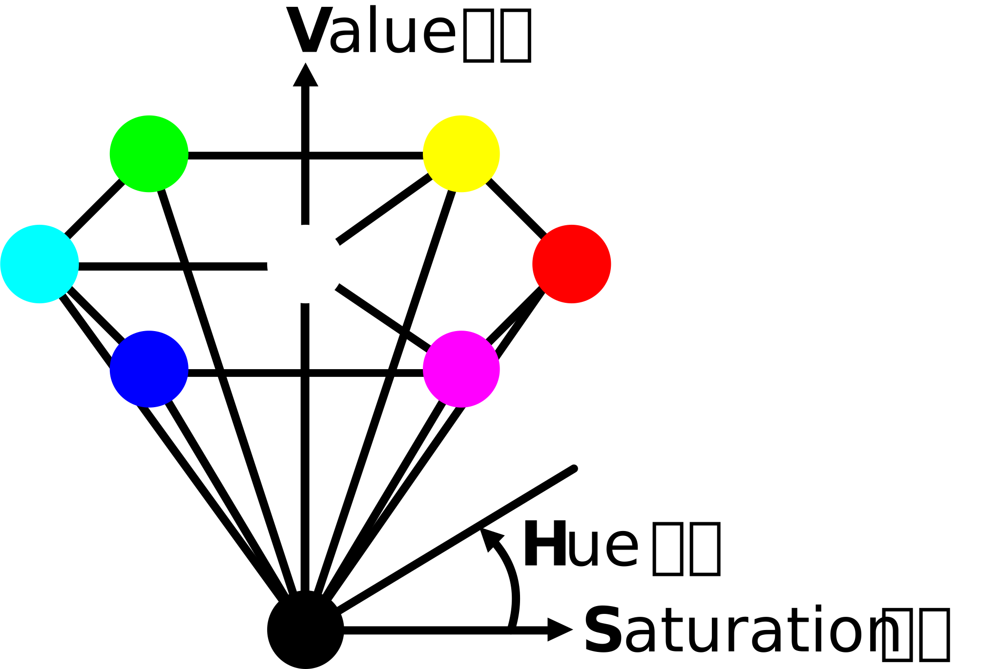
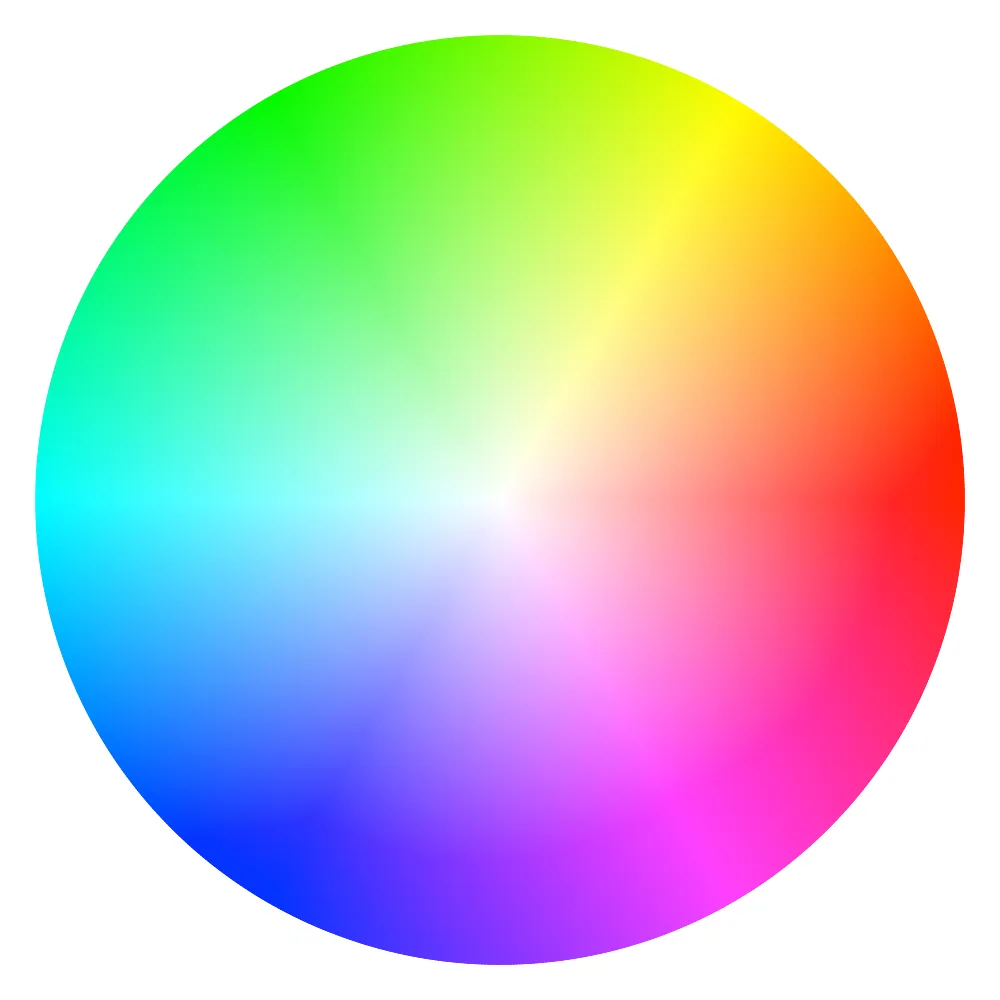
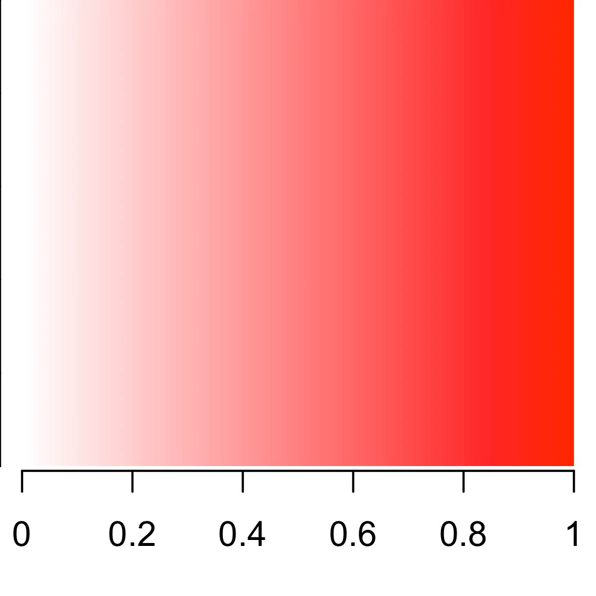
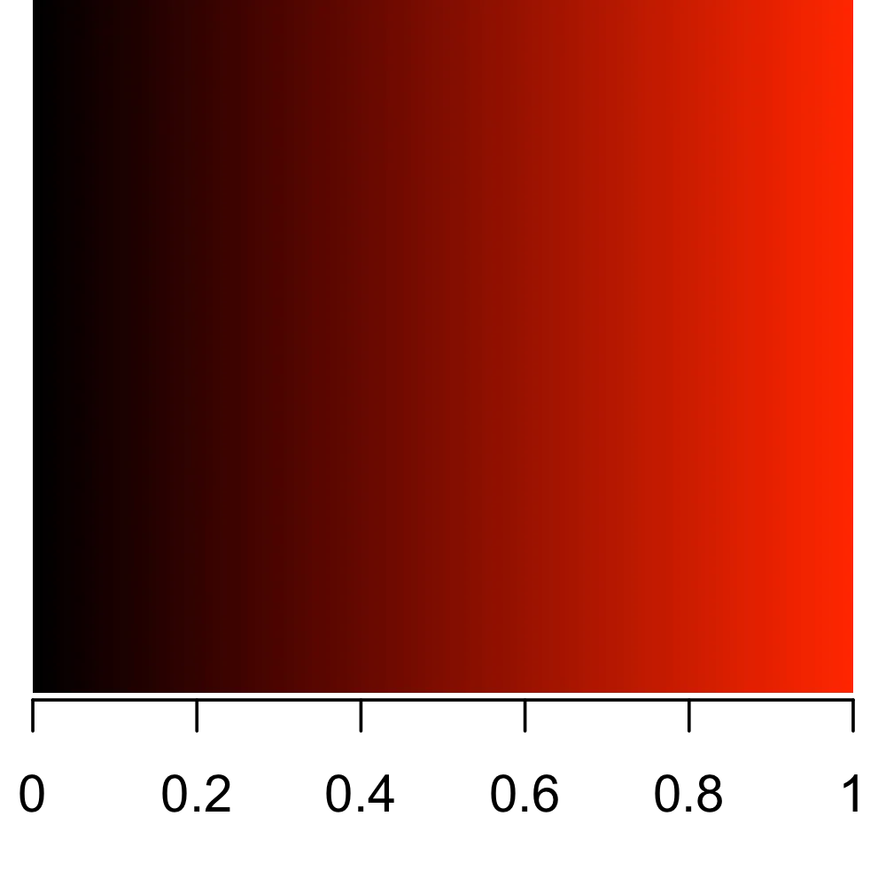
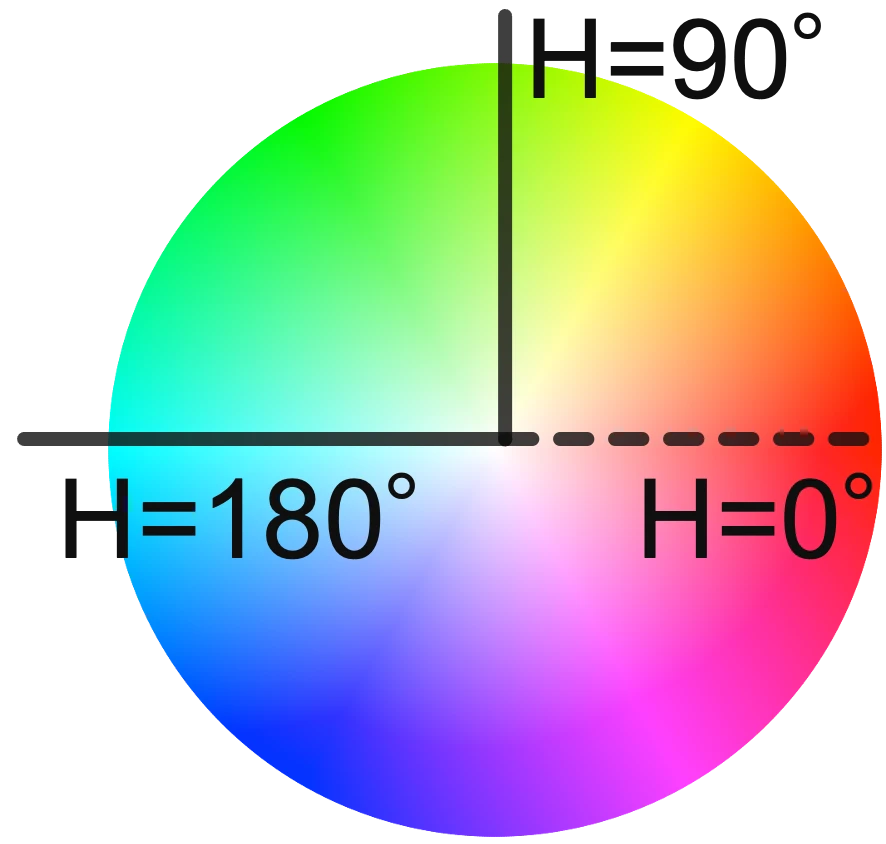
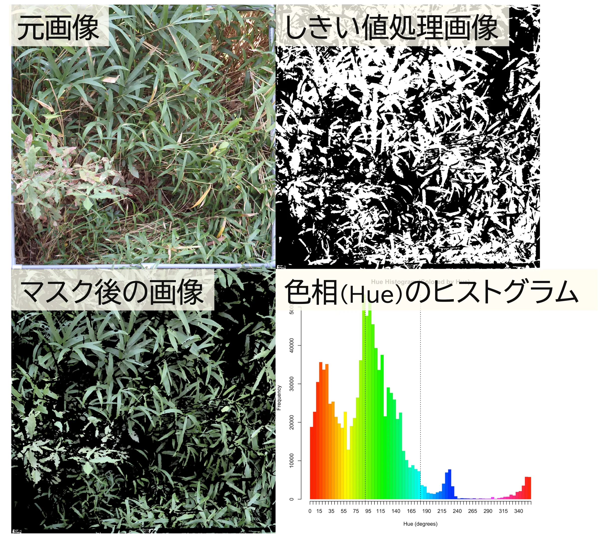
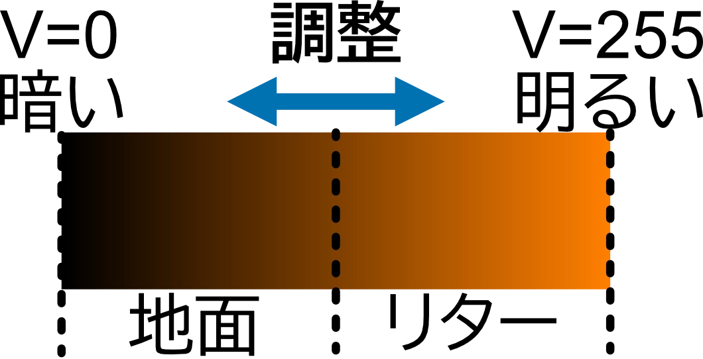

このノートブックでは、HSV色空間について簡単にまとめます。

HSV色空間は、色を表すための方法の一つで、**Hue（色相）**、**Saturation（彩度）**、**Value（明度）**の3つの成分で色を表現します。

- **Hue（色相）**: 色の種類を表す成分で、0°から360°の範囲で表されます。例えば、赤は0°、緑は120°、青は240°などです。
- **Saturation（彩度）**: 色の鮮やかさを表す成分で、0から1の範囲で表されます。0は無彩色（グレー）を表し、1は完全な彩色を表します。
- **Value（明度）**: 色の明るさを表す成分で、0から1の範囲で表されます。0は完全な黒を表し、1は完全な白を表します。

よく説明に使用される六角錐モデルでは、Hueは円周上の角度で表され、Saturationは中心からの距離、Valueは高さで表されます。

色相については、**色相環 color wheel**という円形の図で表されることが多く、色の種類を視覚的に理解しやすくなっています。
以下の図はVが1のときの色相環を示しています。

{height=300px}

また、H=0° (赤色)のときの彩度と明度の変化を以下の図に示します。

::: {layout-ncol=2}

:::

HSV色空間は、画像処理やコンピュータビジョンの分野でよく使用されます。
利点としては、以下のような点が挙げられます。

- **明るさの変動を受けにくい**: HSV色空間では、色相と彩度は明度の影響を受けにくいため、照明条件が変化しても色の特徴を捉えやすいです。
- **色の選択が直感的**: 色相環を使って色を選ぶことができるため、色の選択が直感的に行えます。

例えば、緑色の領域を抽出する場合、HSV色空間では色相が120°付近 (90°-180°程度)の範囲を指定することで、緑色を効率的に抽出できます。

::: {layout-ncol=2}

:::

また、リターは明るい茶色、地面は濃い茶色であるため、H=30°付近における、V (明度)を利用してこれらの領域を区別することができます。

{height=300px}

実際の解析では、写真の明るさや影が異なる、葉の色はどれも一緒でない、地面とリターが明瞭に色が分かれていないことが多いです。
このため、各画像ごとに適切なHSVの範囲を選ぶ必要があります。
