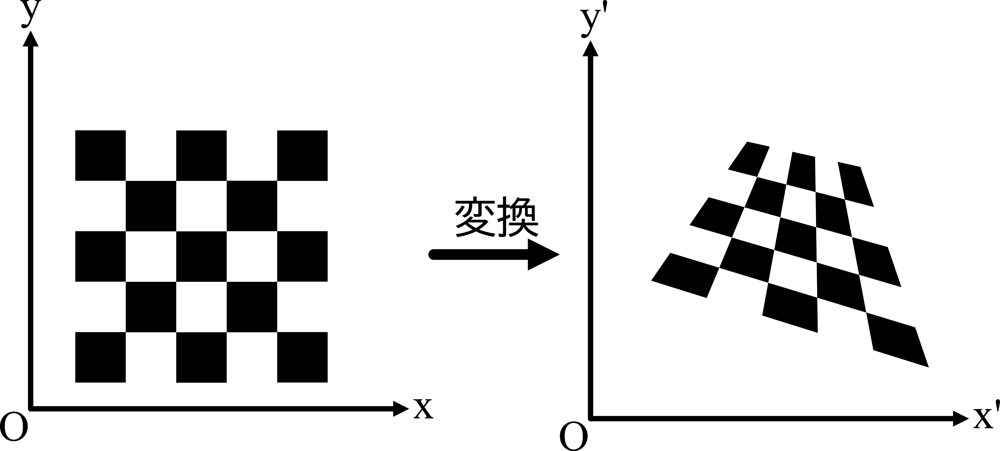

このノートブックでは、射影変換について簡単にまとめます。

射影変換は、ある平面を別の平面に写す変換の一種で、画像処理やコンピュータビジョンの分野で広く使用されます。
たとえば、斜めから撮影した紙やホワイトボードの画像を、正面から見たように補正するときに使われます。

アフィン変換も、拡大・縮小、回転、平行移動、せん断などを表せる重要な変換ですが、射影変換はそれをさらに一般化したものです。
アフィン変換では平行線は平行のまま保たれますが、射影変換では遠近感を扱えるため、平行線が一点に集まるような変形も表現できます。

点($x, y$)を($x', y'$)に射影変換するとき、よく次の形で表されます。

$$
\begin{align*}
x' &= \frac{a x + b y + c}{g x + h y + 1} \\
y' &= \frac{d x + e y + f}{g x + h y + 1}
\end{align*}
$$

ここで、$a, b, c, d, e, f, g, h$は変換のパラメータです。
これらの値は、通常、一直線上にない4組の対応点から求めることができます。

この式には分母に$x$や$y$が含まれるため、通常の2次元座標($x, y$)のままでは、単純な行列積だけで表すことができません。
そこで、$(x, y)$を$(x, y, 1)$のように1つ成分を増やした**同次座標**で表すと、変換を行列でまとめて扱えるようになります。

同次座標では、$(X, Y, W)$ と $(\lambda X, \lambda Y, \lambda W)$（$\lambda \neq 0$）は同じ点を表します。
通常の座標は、$W \neq 0$ のとき

$$x = \frac{X}{W},\; y = \frac{Y}{W}$$

で得られます。

この同次座標を用いると、$(x, y)$ を $(x', y')$ に射影変換するとき、以下のように$$3 \times 3$の行列を使って表すことができます。

$$
\lambda
\begin{bmatrix}
x' \\
y' \\
1
\end{bmatrix}
=
\begin{bmatrix}
a & b & c \\
d & e & f \\
g & h & 1
\end{bmatrix}
\begin{bmatrix}
x \\
y \\
1
\end{bmatrix}
$$

ここで、$\lambda$はスケールを表す係数です。同次座標では定数倍したベクトルが同じ点を表すため、変換後の点は($x', y', 1$)そのものではなく、その定数倍で表されます。

一般的には、真ん中の行列は$h$と添字を使用して文字を少なくして表されることが多いです。

$$
\lambda
\begin{bmatrix}
x' \\
y' \\
1
\end{bmatrix}
=
\begin{bmatrix}
h_{11} & h_{12} & h_{13} \\
h_{21} & h_{22} & h_{23} \\
h_{31} & h_{32} & h_{33}
\end{bmatrix}
\begin{bmatrix}
x \\
y \\
1
\end{bmatrix}
$$

このように、射影変換は、同次座標を用いることで、行列を用いて表すことができます。
この行列を**ホモグラフィ行列**と呼びます。

このように同次座標を導入すると、射影変換を行列の形で統一的に表せます。
その結果、変換の合成や逆変換も線形代数の枠組みで扱いやすくなります。
